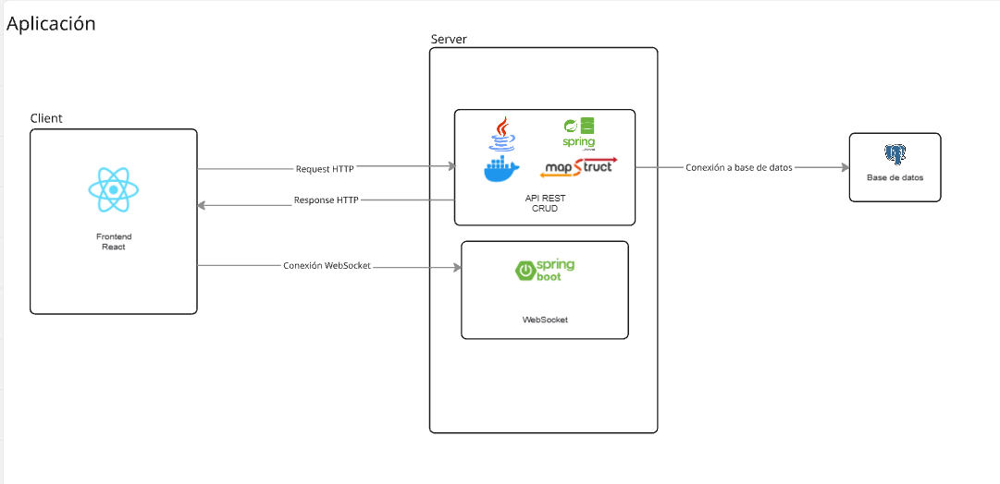
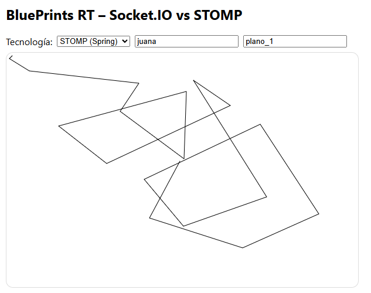
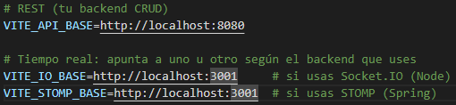

# Lab P4 — BluePrints en Tiempo Real (Stomp)

> **Repositorio:** `DECSIS-ECI/Lab_P4_BluePrints_RealTime-Sokets`  
> **Front:** React + Vite (Canvas, CRUD, y selector de tecnología RT)
>
> - **STOMP (Spring Boot):** https://github.com/miguelvanegas-c/Lab4ARSWStomp
> - **CRUD (Spring Boot):** https://github.com/miguelvanegas-c/Lab3ARSW

## 🎯 Objetivo del laboratorio

Implementar **colaboración en tiempo real** para el caso de BluePrints. El Front consume la API CRUD de la Parte 3 (o equivalente) y habilita tiempo real usando **Socket.IO** o **STOMP**, para que múltiples clientes dibujen el mismo plano de forma simultánea.

---

## 🏗️ Arquitectura



---

## ⚙️ Variables de entorno (Front)

Crea `.env.local` en la raíz del proyecto **Front**:

```bash
# REST (tu backend CRUD)
VITE_API_BASE=http://localhost:8080

VITE_STOMP_BASE=http://localhost:3001  # si usas STOMP (Spring)
```

En la UI, selecciona la tecnología en el **selector RT**.

---

## 🚀 Puesta en marcha

### Backend RT

**Opción B — STOMP (Spring Boot)**  
RT repo:  
https://github.com/miguelvanegas-c/Lab4ARSWStomp

```bash
./mvnw spring-boot:run
# expone: http://localhost:8080
# endpoint WS (ej.): /ws-blueprints
```

### 2) Front (este repo)

```bash
npm i
npm run dev
# http://localhost:5173
```

En la interfaz: selecciona **Socket.IO** o **STOMP**, define `author` y `name`, abre **dos pestañas** y dibuja en el canvas (clics).

---

## 🔌 Protocolos de Tiempo Real (detalle mínimo)

### STOMP

- **Publicar punto**
  ```js
  client.publish({
    destination: "/app/draw",
    body: JSON.stringify({ author, name, point }),
  });
  ```
- **Suscribirse a tópico**
  ```js
  client.subscribe(`/topic/blueprints.${author}.${name}`, (msg) => {
    /* append points y repintar */
  });
  ```

---

## 🧪 Casos de prueba mínimos

- **Estado inicial**: al seleccionar plano, el canvas carga puntos (`GET /api/blueprints/:author/:name`).
  > - Al entrar en la aplicación, se tiene la opción de seleccionar el autor y el nombre de un plano, cargando los puntos de forma instantanea.
  > - 
- **Dibujo local**: clic en canvas agrega puntos y redibuja.
  > - El canvas dibuja en cada click un nuevo punto en el plano
  > - Esta funcionalidad se valida en el video.
- **RT multi-pestaña**: con 2 pestañas, los puntos se **replican** casi en tiempo real.
  > - Este punto se evidencia completamente en el video.
- **CRUD**: Create/Save/Delete funcionan y refrescan la lista y el **Total** del autor.

  > - El plano se guarda cada vez que se agrega un punto.
  > - Se agrego un boton especifico para crear y eliminar planos.

- Todas las funcionalidades se verifican de mejor manera en el video.

---

## 📊 Entregables del equipo

1. Código del Front integrado con **CRUD** y **RT** (STOMP).
2. **Video corto** (≤ 90s) mostrando colaboración en vivo y operaciones CRUD.
3. **README del equipo**: setup, endpoints usados, decisiones (rooms/tópicos), y (opcional) breve comparativa Socket.IO vs STOMP.

---

## 🛠️ Desarrollo

- El desarrollo fue en dos capaz, por un lado servidores en las cuales se implementaron dos, uno que maneja el CRUD de blueprints y otro donde se maneja la interacción en tiempo real.

### Server

#### API REST (CRUD)

- El desarrollo del crud y su explicacion esta en el siguiente repositorio: https://github.com/miguelvanegas-c/Lab3ARSW

#### RT (STOMP)

- El desarrollo del API RT con stomp y su explicación esta en el siguiente repositorio: https://github.com/miguelvanegas-c/Lab4ARSWStomp

### Client

#### FrontEnd

- Para el desarrollo del frontend, se tomo como base el siguiente repositorio: https://github.com/DECSIS-ECI/Lab_P4_BluePrints_RealTime-Sokets
  > - Los cambios que se realizaron fueron los siguientes, primero que todo se selecciono la tecnologia que se iba a usar, y se cambiaron las URLs, para que apunte a los servidores correctos.
  >   
  ##### Estrategia:
  > - El frontend cada vez que se cambia de plano, se conecta a un websocket, donde se subscriben todos los relacionados a dicho plano.
  > - Las operaciones del CRUD las hace llamando directamente al API REST incluso cuando incierta un nuevo punto.
  > - Al insertar un nuevo punto lanza un evento a todos los subscritores del plano, para que actualicen su vista.
  > - Todo este funcionamiento se muestra completamente en el siguiente video: https://www.youtube.com/watch?v=3FY82fOJOK8

## 📄 Licencia

MIT (o la definida por el curso/equipo).
